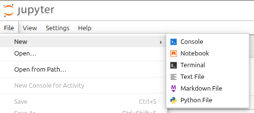
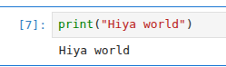
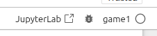
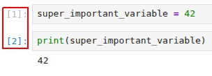
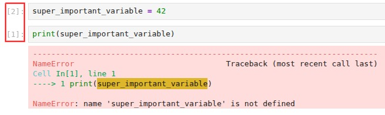
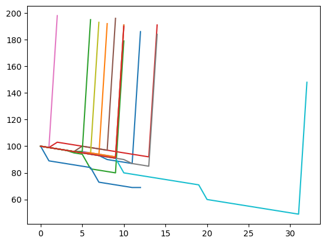
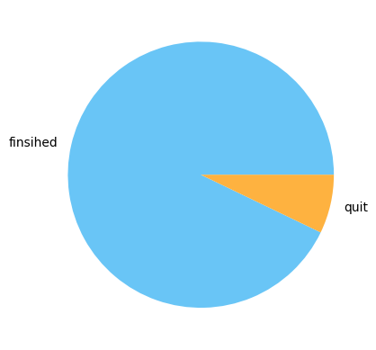
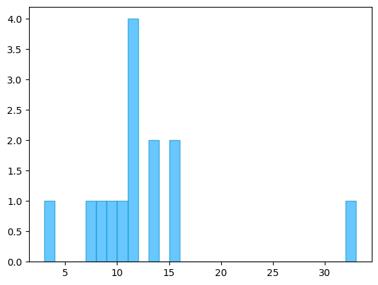
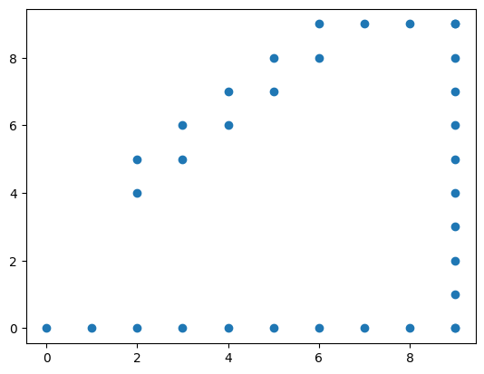
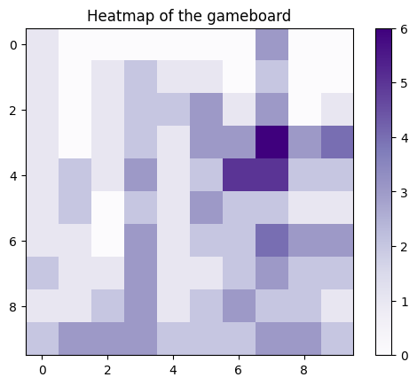

# Exploring events
In this step, we will take the time to explore the data side of Python. Data science and Python go hand in hand. Most newly created agentic products are built with Python in mind. They almost always provide a Python client. This stems from a long history of machine learning libraries that have proven to be very effective—think of [Scikit-learn](https://scikit-learn.org/stable/) and [TensorFlow](https://www.tensorflow.org/). These are complemented by extensive data visualization and exploration libraries like [NumPy](https://numpy.org/), [Pandas](https://pandas.pydata.org/), and [Matplotlib](https://matplotlib.org/). These three libraries we will use for our data visualizations, but there is one more key reason why Python has become a standard for data science: Python/[Jupyter](https://jupyter.org/) notebooks.

## What are notebooks?
Jupyter notebooks are interactive documents that combine **live Python code**, **rich text**, **visualizations**, and **other media** in a single, shareable file. They allow you to write code in small blocks (called *cells*) and execute them one at a time, which is ideal for experimentation and iterative analysis.  

Notebooks are widely used in data science for several reasons:

- **Exploration first:** You can quickly test code, inspect outputs, and tweak parameters without running an entire script.  
- **Visualization:** Plots from Matplotlib, Pandas, or other libraries appear inline, making data exploration more intuitive.  
- **Documentation:** Markdown cells let you add explanations, headers, images, or even equations using LaTeX.  
- **Reproducibility:** You can share notebooks with others, preserving code, results, and commentary in one file.  

In short, Jupyter notebooks make Python extremely approachable for data analysis, experimentation, and communicating results—perfect for both beginners and professionals in data science.

## Setting up a notebook
From the `{GAMENAME}` root directory, we will first install the dependencies needed for data exploration. These include the libraries for data manipulation, and visualization. The lsp dependencies are optional, they allow code completion and linting in python notebooks.

```Bash
$ uv add --dev ipykernel
$ uv add --dev jupyterlab-lsp python-lsp-server
$ uv add numpy pandas matplotlib
```

Once installed, we can set up the kernel so that the notebook uses the correct virtual environment.

```Bash
$ uv run ipython kernel install --user --env VIRTUAL_ENV $(pwd)/.venv --name {GAMENAME}
```

This registers your project environment as a Jupyter kernel, which allows notebooks to automatically use the correct Python interpreter and all installed dependencies. It ensures that the code you run in the notebook is isolated to your project environment.

Now we are ready to start the notebook server and begin exploring data interactively. This command launches Jupyter in your browser, where you can start with a new notebook.

```Bash
$ uv run --with jupyter jupyter notebook
```

Within the jupyters page, you can create a notebook by selecting **File** -> **New** -> **Notebook** 



## How does a notebook work?

In this chapter there is more information on how a jupyter notebook works. If you are already familiar with how a notebook works you can skip this, but if you have never used one I suggest reading through them. There are a few concepts that you'll need to understand about a Jupyter notebook.

<details>
<summary><strong>Options</strong></summary>

In the image below, you see the options bar in a Jupyter Notebook. From left to right, here’s what each button does:

- Save the file (**Ctrl + S**)  
- Insert a new cell below the selected one (**B**)  
- Cut the selected cell (**X**)  
- Copy the selected cell to the clipboard (**C**)  
- Paste a new cell from the clipboard (**V**)  
- Run the current cell and create a new one (**Shift + Enter**)  
- Interrupt the kernel  
- Restart the kernel  
- Restart the kernel and run all cells from top to bottom  
- Select the cell type (e.g., Code, Markdown)


</details>
<details>
<summary><strong>Running cells</strong></summary>

There are multiple ways to run a cell:

- Click the **Run (▶)** button in the toolbar  
- Press **Shift + Enter** to run the cell and move to a new one  
- Press **Ctrl + Enter** to run the cell without creating a new one  



</details>
<details>
<summary><strong>Kernel selection</strong></summary>

Sometimes you may encounter errors about missing libraries (even if you installed them using UV) or an unconfigured kernel.  

You can fix this by selecting the correct kernel in the top-right corner of the notebook (see image above). Make sure to choose the kernel associated with your environment.



</details>
<details>
<summary><strong>Cell execution and variable scope</strong></summary>

Each cell is a standalone piece of executable code, but cells share the same environment.

This means:
- Variables defined in one cell can be used in other cells  
- However, a variable is only available if the cell that defines it has already been executed  

The images below demonstrate this:




</details>

## Adding data
In this chapter you'll get more acquainted with the three libraries we will use for the graphs and visualisation. 

### Initiate the data into the notebook

To extract the data from the file we are going to use pandas. It is a very basic line but the path has to be correct.

```python
import pandas as pd

df = pd.read_json('game_events.jsonl', lines=True)

df
```

### Data Structures
<details>
<summary><strong>Core Python</strong></summary>

Python provides several built-in data structures:

- **List**
  - Ordered and mutable (can be changed)
  - Example: `[1, 2, 3]`

- **Tuple**
  - Ordered but **immutable** (cannot be changed after creation)
  - Example: `(1, 2, 3)`
  - Often used to group related values (e.g., coordinates)

- **Dictionary**
  - Stores data as key–value pairs
  - Example: `{"name": "Alice", "age": 25}`

- **Set**
  - Unordered collection of unique elements
  - Example: `{1, 2, 3}`

</details>

<details>
<summary><strong>NumPy</strong></summary>

NumPy is designed for numerical computing and uses a primary structure:

- **ndarray (N-dimensional array)**
  - Efficient, fixed-type array (all elements have the same data type)
  - Supports fast mathematical operations
  - Example:
    ```python
    import numpy as np
    arr = np.array([1, 2, 3])
    ```

Key features:
- Faster than Python lists for numerical data  
- Supports multi-dimensional data (e.g., matrices)  
- Enables vectorized operations (no need for loops)

</details>

<details>
<summary><strong>Pandas</strong></summary>

pandas builds on NumPy and introduces higher-level structures:

- **Series**
  - One-dimensional labeled array
  - Similar to a single column in a table
  - Example:
    ```python
    import pandas as pd
    s = pd.Series([10, 20, 30])
    ```

- **DataFrame**
  - Two-dimensional labeled data structure
  - Similar to a table with rows and columns
  - Each column can have a different data type
  - Example:
    ```python
    df = pd.DataFrame({
        "name": ["Alice", "Bob"],
        "age": [25, 30]
    })
    ```

A DataFrame is a core data structure in libraries like pandas. It is similar to a table , but it is not exactly the same.

Like a table, a DataFrame has labeled **columns**, which makes it easy to understand what each column represents.  

Unlike a basic table, a DataFrame also has labeled **rows**, called the *index*. By default, these row labels are numbers.

</details>

### Working with DataFrames

There are many ways to transform, filter, and navigate through a DataFrame. In this workshop, we will cover a few important ones, but there is much more you can do.

For a full overview, check out this cheat sheet:  
https://pandas.pydata.org/Pandas_Cheat_Sheet.pdf

<b>Data frame code examples:</b>

```python
# Make a copy from the Dataframe
df_copy = df.copy()

# Retrieve a single 
df['score'][0]

# Order row by values of a column
df.sort_values('score', ascending=False)

# Remove columns
df.drop(columns=['Length', 'Height'])

# Remove duplicates row from dataframe
df.drop_duplicates()

# Count all values
df["type"].value_counts()

# Select rows between 0 and 100
df.iloc[0:100]

# Select rows meeting condition, and only the specified columns
df.loc[df['score'] > 200, ['score', 'message']]
df.loc[df['type'].isin(['a','b'])]

# Query and filter the rows
df.query('score > 200')

# Dataframe change NA/null
df.dropna()
df.fillna(value)
```


## Data visualisations

In this section, you will find the assignments. Each assignment has a Type, which indicates what kind of output/chart is required, and a Goal, which describes the requirements for the visualization. Each assignment also includes helpful resources to save you time searching.

At the end of each assignment, there is a Result (spoilers) section. As the name suggests, only open it if you want to see the expected result.

### 0. Playing around with Pandas

The next three tasks allow you to play around with the data and work with Pandas. This step is essential before starting the actual visualisations.

---
- Type: DataFrame table
- Goal: Find all events where the exit was found
---
- Type: DataFrame table
- Goal: Sort all exit events by score descending
---
- Type: DataFrame table
- Goal: Show only the columns: timestamp, score and game_id
---
<details>
<summary><strong>Result (spoilers)</strong></summary>

There are multiple way the three can be achieved but here is a solution for each:

```python
df0 = df.copy()
#- Find all events where the exit was found
df_exits = df0.query('message.str.contains("exit")', engine="python")
#- Sort all exit events by score descending
df_score_sorted = df0.sort_values('score', ascending=False)
#- Show only the columns: timestamp, score and game_id
df_three_columns = df0.iloc[:,[1,2,3]]
```

</details>

### 1. Timeline of the agent’s score

- Type: Line chart
- X-axis: timestamp
- Y-axis: score
- Goal: Show how the agent’s score changes over time or per step.

Helpfull resources: [W3-Lineplot](https://www.w3schools.com/python/matplotlib_line.asp) & [GfG-Split](https://www.geeksforgeeks.org/python/split-pandas-dataframe-by-rows/)

<details>
<summary><strong>Result (spoilers)</strong></summary>


</details>

### 2. Completion statistics

- Type: Bar chart or pie chart
- Goal: Show how many games were completed successfully (exit found) vs ended by user or aborted.

Helpfull resources: [W3-Pie_chart](https://www.w3schools.com/python/matplotlib_pie_charts.asp) & [W3-Bar_chart](https://www.w3schools.com/python/matplotlib_bars.asp)

<details>
<summary><strong>Result (spoilers)</strong></summary>

```python
plt.pie(y, labels=labels, colors=["#69c5f6", "#feb240"])
```

</details>

### 3. Step counts per game

- Type: Histogram
- Goal: Explore the number of steps players or agents took to reach the exit.
- Mark up Requirements: 30 bins, #2ab0ff color, #169acf edge color, 0.7 alpha

Helpfull resources: [W3-Histogram](https://www.w3schools.com/python/matplotlib_histograms.asp) & [GfG-iterate](https://www.geeksforgeeks.org/pandas/different-ways-to-iterate-over-rows-in-pandas-dataframe/)

<details>
<summary><strong>Result (spoilers)</strong></summary>

```python
plt.hist(data, bins=30, color='#2ab0ff', edgecolor='#169acf', alpha=0.7)
```

</details>

### 4. Path visualization

- Type: Scatter/line plot on a grid
- X-axis: column
- Y-axis: row
- Goal: Show the path the agent took through the grid on a <b>single</b> game.

Helpfull resources: [W3-scatter](https://www.w3schools.com/python/matplotlib_scatter.asp) & [Pandas-Groupby](https://builtin.com/data-science/pandas-groupby#:~:text=Get%20Groups,group%20from%20the%20GroupBy%20object.)

<details>
<summary><strong>Result (spoilers)</strong></summary>
For this scatter plot we have used the game ID <b>e0903690-74e7-4778-a1f5-b97e156eeecc</b>


</details>

### 5. Movement heatmap

- Type: 2D grid heatmap
- X-axis: column
- Y-axis: row
- Value: number of times the agent visited each cell (or cumulative score at that cell)
- Goal: See which areas of the grid were visited most frequently.

Helpfull resources: [GfG-Heatmap](https://www.geeksforgeeks.org/python/how-to-draw-2d-heatmap-using-matplotlib-in-python/) & [Pandas-DF-Docs](https://pandas.pydata.org/docs/reference/api/pandas.DataFrame.html)

<details>
<summary><strong>Result (spoilers)</strong></summary>


</details>
